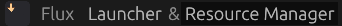

# 🚀 Getting Started with Flux

Welcome to Flux! This guide will help you understand the application's structure and direct you to where you can begin managing your Minecraft content effectively.

Flux is your comprehensive tool for both launching Minecraft and organizing your mods, shaders, resource packs, and more.

---

## Navigating Flux's Main Views

When you open Flux, you'll see primary navigation options, typically displayed in the top-left corner of the window. These options allow you to switch between the application's core functionalities: Flux **Launcher** & **Resource Manager**.

*   **Launcher**
    *   This section is designed for managing your game profiles, selecting Minecraft versions, and starting your game sessions.

*   **Resource Manager**
    *   This is the powerful hub where you'll spend most of your time organizing your Minecraft content. Here, you can create and manage lists of mods, download new resources from Modrinth, update your existing library, and much more.

---

## Your Next Step: Dive into Resource Management!

Since the game launching features are still being refined, the best way to experience Flux's capabilities right now is through the **Resource Manager**. It provides a fast and intuitive way to set up your first modded Minecraft list.

**Let's get your first list created and populate it with resources!**

➡️ **[Begin with the Resource Manager's Get Started Guide!](usage/resource-manager/get_started.md)**