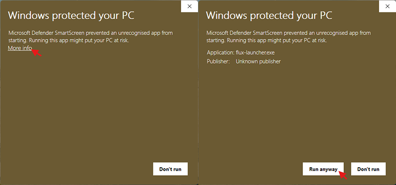
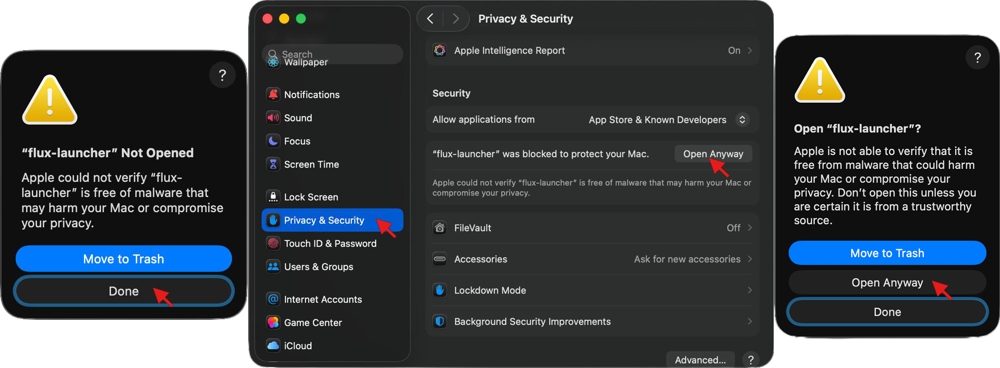

# 🚀 Installation

Getting started with Flux is straightforward. We provide pre-compiled binaries for Windows, macOS, and Linux.

### 1. Download
Head over to the **[GitHub Releases](https://github.com/allwepro/flux-project/releases)** page and grab the latest version for your operating system.

### 2. Unpack and Run
The release is typically provided in a compressed format (zip/tar.gz).
1. **Unpack:** Extract the contents of the downloaded folder to a location of your choice.
2. **Execute:** Locate the `flux` executable and run it.

### 🛡️ Security Warnings
Since Flux is an independent, open-source project and is not "code-signed" with expensive certificates from Microsoft or Apple, your operating system may flag it as "untrusted."

**This is a standard procedure for many open-source tools.** Below is how to safely proceed:

#### **Windows (SmartScreen)**
**Why this appears:** Windows SmartScreen flags any executable that hasn't been downloaded by thousands of users yet or isn't signed by a registered corporation.

1. When the blue "Windows protected your PC" popup appears, click **"More info"**.
2. A new button will appear. Click **"Run anyway"**.



#### **MacOS (Gatekeeper)**
**Why this appears:** macOS Gatekeeper blocks apps that are not from the App Store or from "Identified Developers".

1. If you see a '"flux" not Opened' message, click **Done**.
2. Open **System Settings** (or System Preferences) > **Privacy & Security**.
3. Scroll down to the **Security** section.
4. You will see a message saying 'Flux was blocked to protect your Mac.' Click **"Open Anyway"**.
5. If you see another prompt saying 'Open "flux"?', click **"Open Anyway"** to confirm you want to run the app.
6. Enter your password if prompted to confirm.



---

### 🛠️ Compile from Source
If you prefer not to use pre-compiled binaries, you can build Flux directly from the source code:

```bash
# Clone the repository
git clone https://github.com/allwepro/flux-project.git
cd flux-project

# Build and run in release mode
cargo run --release
```