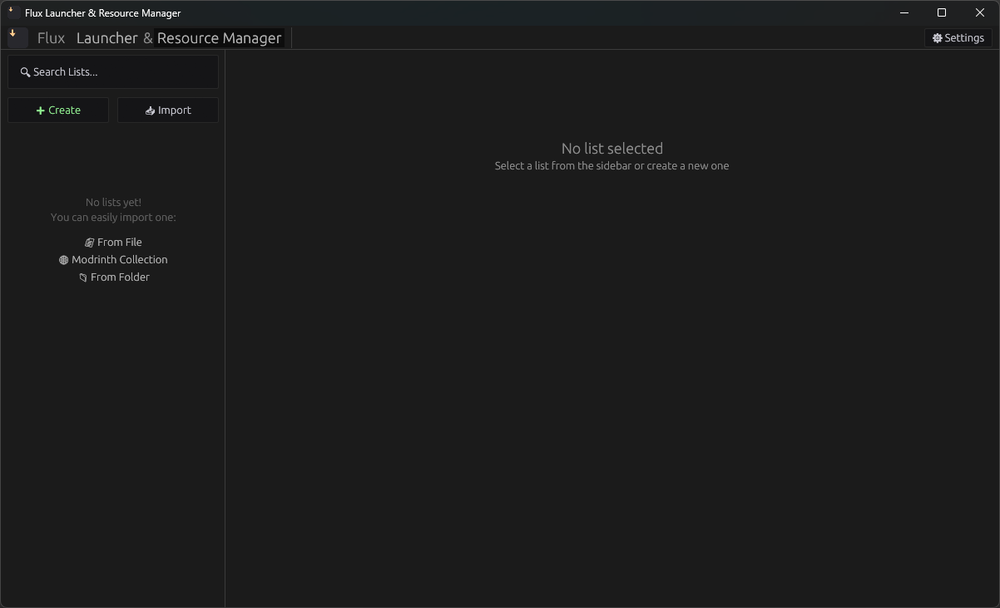
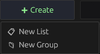
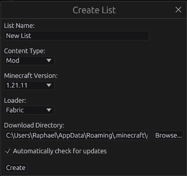
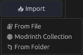
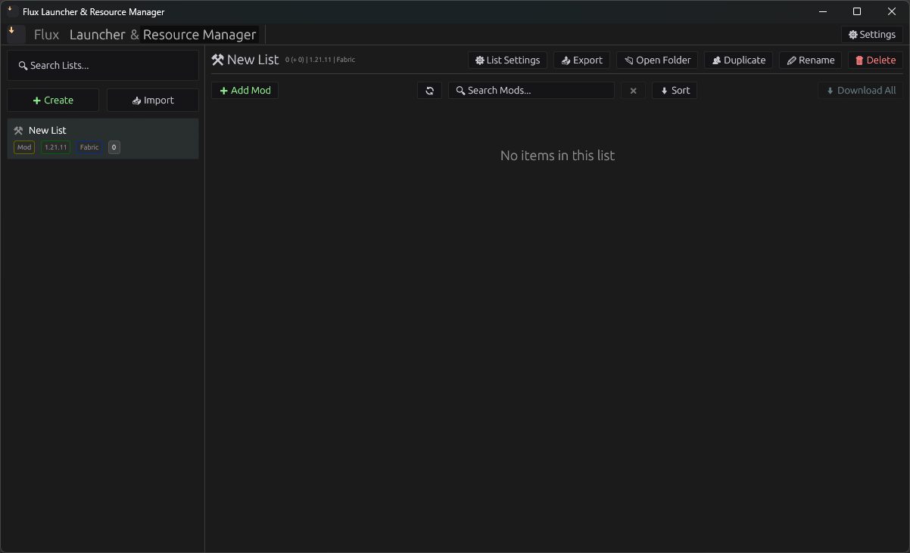
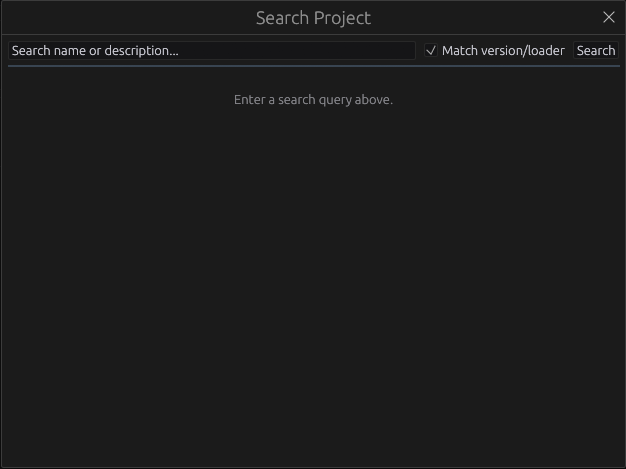
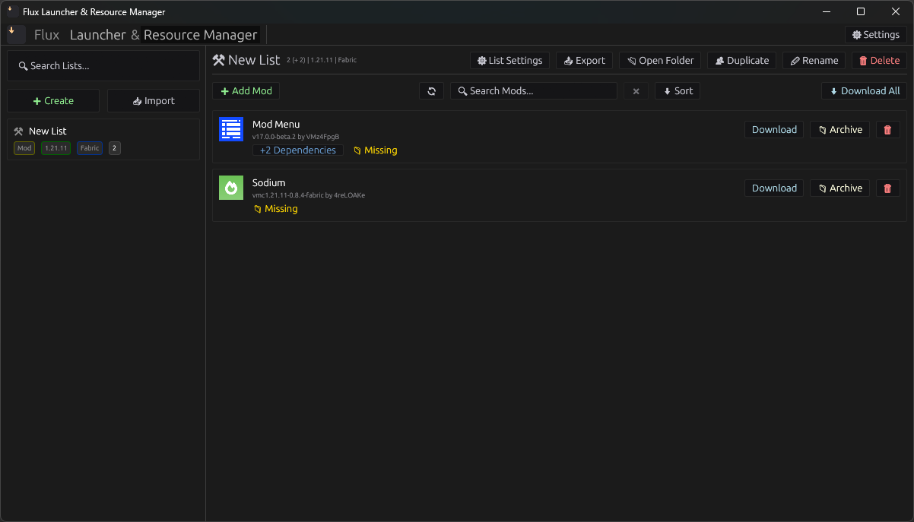
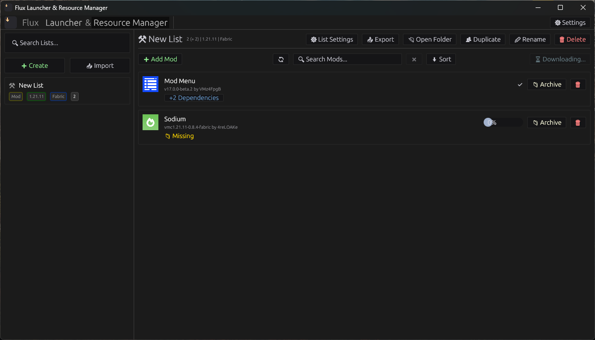
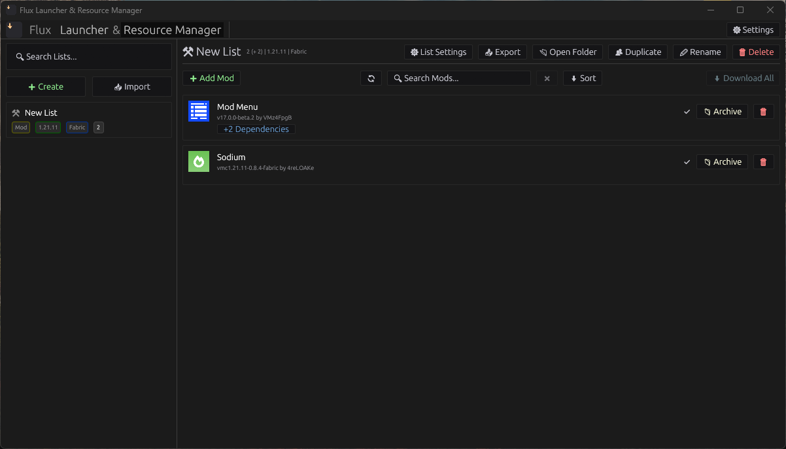

## 🚀 Get Started with Flux's Resource Manager!

Welcome to Flux! This guide will quickly show you how to create your first mod list, add resources, and get them downloaded. Let's get your Minecraft setup ready!
As a first step you need to have Flux installed. If you haven't done that yet, check out our [Installation Guide](../../installation.md) first.
Then after successfully installing Flux, you can open the Resource Manager by clicking the "Resource Manager" text in the top left if it's not already open.

---

## 1. The Resource Manager Interface

The Resource Manager has two main areas:
*   **Left Sidebar:** Where you manage your different **Lists** (your mod profiles).
*   **Main View:** Shows the content of your selected list, where you add and manage resources.

---

## 2. Start Your First List

You have two main ways to begin: **Create a New List** from scratch or **Import an Existing Collection.**

### Option A: Create a New List (Recommended for beginners)

1.  **Click "➕ Create"**: Find this green button at the top-left of the sidebar.
    

2.  **Configure Your List**: A dialog will ask for essential details. These define which mods are compatible.
    *   **Name:** Give it a clear name (e.g., "My Survival Mods").
    *   **Minecraft Version:** Select your target Minecraft version (e.g., `1.21.11`).
    *   **Loader Type:** Choose your mod loader (e.g., `Fabric`, `Forge`).
    *   **Download Directory:** This is where Flux will save your files. You can leave the default.

    

3.  **Confirm**: Click "Create" to add your new, empty list to the sidebar.

### Option B: Import an Existing Collection (If you have one)

If you already have an existing Minecraft folder or a Modrinth collection:

1.  **Click "Import"**: This button is at the top of the sidebar.

2.  **Choose an Option**: Select "From File" (for `.mmd` or legacy mod lists), "Modrinth Collection" (for a URL), or "From Minecraft Folder" (to scan an existing game folder). Follow the prompts to set it up.
    
    

---

## 3. Add Resources to Your List

Now, let's find some mods! Flux connects directly to Modrinth.

1.  **Click "➕ Add [Resource Type]"**: In the main view, click the button (e.g., "➕ Add Mod"). This opens the **Search Modal**.

2.  **Search & Add**:
    *   Type keywords (e.g., "Sodium").
    *   Results automatically filter for your list's **Minecraft Version** and **Loader Type**.
    *   Click the **"Add"** button next to each resource you want.
    *   Close the modal when done.

    

3.  **Resources Appear**: The added resources will now be in your list, showing a `📁 Missing` badge.
    

---

## 4. Download Your Resources

Time to get the files onto your computer!

1.  **Click "⬇ Download All"**: This button, found in the toolbar at the top right of the main view, will download all missing resources in your list.

2.  **Check Progress**: The button changes to "⏳ Downloading...", and individual resources show progress.
    

3.  **Finished!**: Once downloaded, resources show a `✅` badge, meaning they're ready!
    